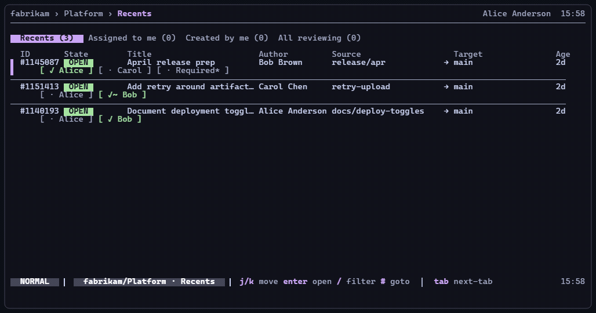

# adotop

[](https://github.com/superyyrrzz/adotop/actions/workflows/ci.yml)
[](https://github.com/superyyrrzz/adotop/releases)
[](LICENSE)
[](https://pkg.go.dev/github.com/superyyrrzz/adotop)

Review [Azure DevOps](https://dev.azure.com) pull requests without touching the
browser.

`adotop` is a fast terminal UI for triaging PR queues, reading diffs, replying
to review threads, and approving changes from the keyboard. It is built for
developers who spend their day in terminals but still need to work in Azure
DevOps.



## Install

### Windows (Scoop)

```sh
scoop bucket add adotop https://github.com/superyyrrzz/adotop
scoop install adotop
```

### macOS / Linux (Homebrew)

```sh
brew tap superyyrrzz/adotop https://github.com/superyyrrzz/adotop
brew install adotop
```

### From source (any OS)

```sh
go install github.com/superyyrrzz/adotop/cmd/adotop@latest
```

Requires Go 1.26+.

### Prebuilt binary (any OS)

Download from [releases](https://github.com/superyyrrzz/adotop/releases) and
drop the `adotop` binary on your `PATH`.

## Quick start

```sh
# 1. One-time: log in to Azure DevOps via the az CLI.
az login

# 2. Run. First launch walks you through writing ~/.adotop/config.toml.
adotop
```

To re-run setup later, or change org/project: `adotop init`.

You can also jump straight to a PR:

```sh
adotop 1145743
adotop https://dev.azure.com/your-org/your-project/_git/your-repo/pullrequest/1145743
```

## Why adotop?

Azure DevOps has a capable PR system, but its browser workflow can be slow when
you are moving through many reviews. `adotop` keeps the review loop close to
where code work already happens.

- **Queue triage is fast.** Browse Recents, Assigned-to-me, Created-by-me, and
  Reviewing tabs without opening separate browser pages.
- **Diffs stay readable.** Use local `git diff` when a clone is available, or
  fall back to Azure DevOps REST diffs when it is not.
- **Threads live inline.** Review comments appear under their target diff line,
  with keyboard navigation and expand/collapse for long discussions.
- **Review actions are one keystroke away.** Comment, reply, resolve, approve,
  vote, abandon, or open the PR in a browser only when needed.
- **Stale approvals are visible.** When new commits land after your approval,
  `adotop` marks the vote as stale using Azure DevOps event history.
- **It works across teams.** Linux, macOS, and Windows are covered by CI and
  release builds.

## Demo highlights

The demo above shows the main review loop:

- Move through PR queues without opening Azure DevOps in a browser.
- Open a PR, scan changed files, status checks, reviewers, and stale vote state.
- Read syntax-highlighted diffs with inline review threads.
- Switch focus between the file list and diff pane, then approve or open help from the keyboard.

## Features

- **Browse PRs** across Recents, Assigned-to-me, Created-by-me, and Reviewing
  tabs. Background refresh keeps the list current without you re-entering each
  PR.
- **Read diffs** with syntax highlighting. Local clone? `git diff` is used
  directly so you get the exact output you would see in your editor. No clone?
  The REST fallback handles binary files, unicode, and large files gracefully.
- **Walk threads inline.** Comments render under their target diff line, not in
  a footer, with a cursor that highlights the active thread and expand/collapse
  for long discussions.
- **Leave comments without leaving the TUI.** A textarea overlay lets you type
  multi-line comments while the diff stays visible behind it. `ctrl+e` drops to
  `$EDITOR` if you would rather use vim.
- **Detect stale approvals.** When the author pushes new commits after your
  approval, the My Vote line shows `stale, re-approve needed`, derived from
  Azure DevOps VoteUpdate events instead of a local cache.
- **Inspect per-commit diffs.** Press `M` to view a single commit's changes
  instead of the accumulated PR diff.
- **Approve, vote, or abandon quickly.** Press `a` to approve, `v` for the full
  vote menu, or `X` to abandon with confirmation.
- **Respect your terminal theme.** Use your terminal ANSI palette by default, or
  opt into Catppuccin with automatic light/dark detection.

## Keys

Press `?` from any screen for the full reference. The most common ones:

| Key | What |
|---|---|
| `j` `k` | move cursor, wrapping at edges |
| `enter` | open / drill in |
| `space` | expand thread under cursor |
| `tab` | switch Files ↔ Diff focus |
| `[` `]` | prev / next thread |
| `c` `C` | new comment / reply |
| `a` `v` | approve / open vote menu |
| `M` | view a single commit's diff |
| `o` | open in browser |
| `?` | toggle help |
| `esc` | back / close modal |

The statusline only shows hints relevant to your current state, so the list
grows as you discover features instead of dumping every key at once.

## Config

`~/.adotop/config.toml` uses the same path on Windows, macOS, and Linux:

```toml
org              = "your-org"           # default ADO organization
project          = "your-project"       # default project
refresh_interval = "60s"                # background list refresh cadence
repo_roots       = ["~/code", "~/work"] # where adotop looks for local clones
```

Logs land in `~/.adotop/logs/adotop.log`.

## Theming

`adotop` uses your terminal's own ANSI palette by default, so Solarized,
Gruvbox, Windows Terminal, and other schemes work without extra config. To opt
into Catppuccin, set `ADOTOP_THEME`:

| Value | Effect |
|---|---|
| unset / `system` | Use terminal ANSI 4-bit palette, the default |
| `auto` | Catppuccin, picked from terminal background |
| `dark` | Force Catppuccin Mocha |
| `light` | Force Catppuccin Latte |

`auto` queries the terminal's background color via OSC 11. Some multiplexers,
older tmux versions, and SSH setups do not proxy it; if auto-detect picks the
wrong one, set `ADOTOP_THEME` to `dark` or `light` explicitly.

## Compatibility

- **OS:** Linux, macOS, Windows 10+. CI runs all three.
- **Terminal:** any 256-color terminal. Emoji glyphs used in status pills and
  the Discussion entry need a font with emoji coverage. Most defaults do; if
  you see boxes instead of emoji, install a fallback emoji font such as
  Cascadia Code PL or Segoe UI Emoji.
- **Auth:** the `az` CLI is required. Run `az login` once, and `adotop` reuses
  the cached token.

## Build from source

```sh
git clone https://github.com/superyyrrzz/adotop
cd adotop
make build      # produces ./adotop.exe on Windows, ./adotop elsewhere
make test       # unit tests, all OSes
make test-live  # hits a real ADO PR; requires az login
```

## Project status

`adotop` is usable today and still moving quickly. Bug reports, rough edges in
Azure DevOps compatibility, terminal rendering issues, and workflow suggestions
are especially useful.

For repository metadata, the most useful GitHub topics are `azure-devops`,
`pull-requests`, `tui`, `terminal`, `go`, `bubbletea`, `cli`, `code-review`,
and `developer-tools`.

## Contributing

Issues and PRs are welcome. See [CONTRIBUTING.md](CONTRIBUTING.md) for the
short version: open an issue first for big changes, tests are required, and
`make test` must pass.

## License

[MIT](LICENSE)
